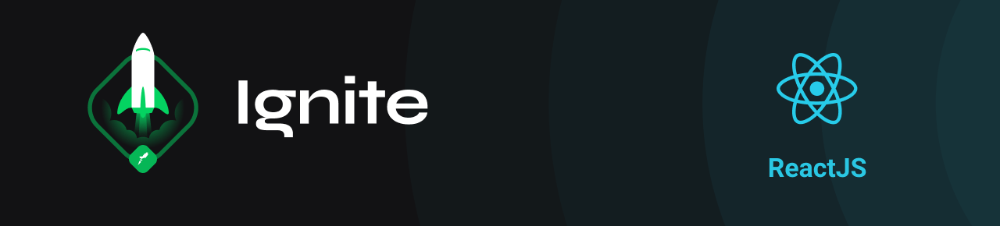
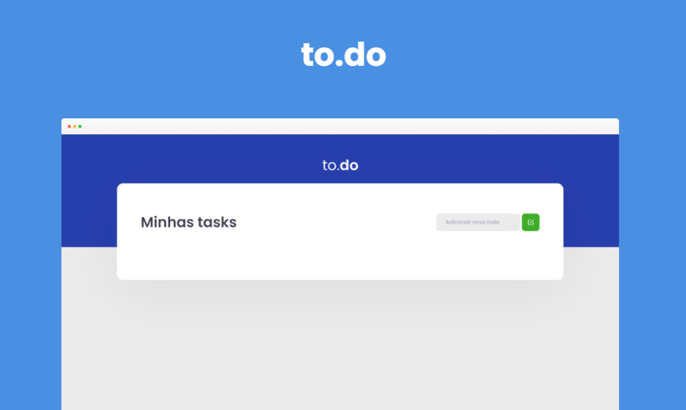

<div align="center">

</div>

## 💻 Desafio

Uma aplicação clássica de atividades a fazer.

Foi desenvolvida com o objetivo de treinar **manipulação de estado** no ReactJS, utilizando Typescript e trainando conceitos de hooks de estado como useState.



- Adicionar uma nova tarefa
- Remover uma tarefa
- Marcar e desmarcar uma tarefa como concluída
## 🚀 Tecnologias

Esse projeto foi desenvolvido com as seguintes tecnologias:

- [ReactJS](https://pt-br.reactjs.org/)
- [Typescript](https://www.typescriptlang.org/)
- [Babel](https://babeljs.io/)
- [Webpack](https://webpack.js.org/)

## 🔖 Funcionalidades:


```bash
# Clone this project
$ git clone https://github.com/ricardoltt/todo

# Access
$ cd todo

# Install dependencies
$ yarn

# Run the project
$ yarn dev

# The server will initialize in the <http://localhost:8080>
```

<div align="center">

### Let's code! 🚀

Made with love by **Ricardo Temoteo** ❤️ Me adiciona no [Linkedin!](https://www.linkedin.com/in/ricardoltt/)

</div>